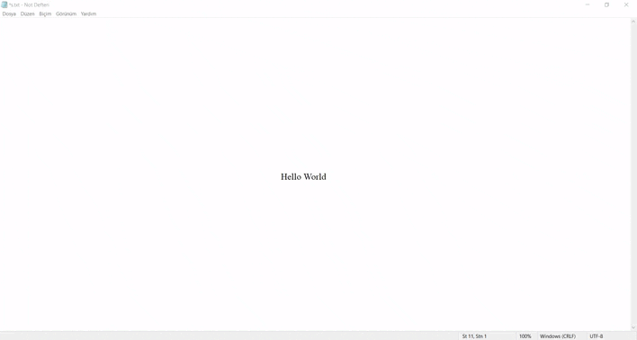

# Hastane Otomasyonu / Hospital Automation

## Tanım / Definition

***TR***
- Detaylı hastane otomasyon uygulamasıdır.
- Vezne-Hasta Kabul, Poliklinik ve Depo alanları tamamlanmıştır.
- Bu uygulama ile hasta kaydedebilir, randevu verebilir, tahlil isteyebilirsiniz.
- Raporlama özelliği ile istediğiniz bilgileri yazdırabilirsiniz.
 

***EN***
- It is a detailed hospital automation application.
- Cashier-Patient Admission, Polyclinic and Warehouse areas have been completed.
- With this application, you can register patients, make an appointment, and request analysis.
- At the same time, you can print the information you want with the reporting feature.

## Kullanılanlar / Use Ones

- Access Database
- OleDB - SQL
- Windows Form Application
